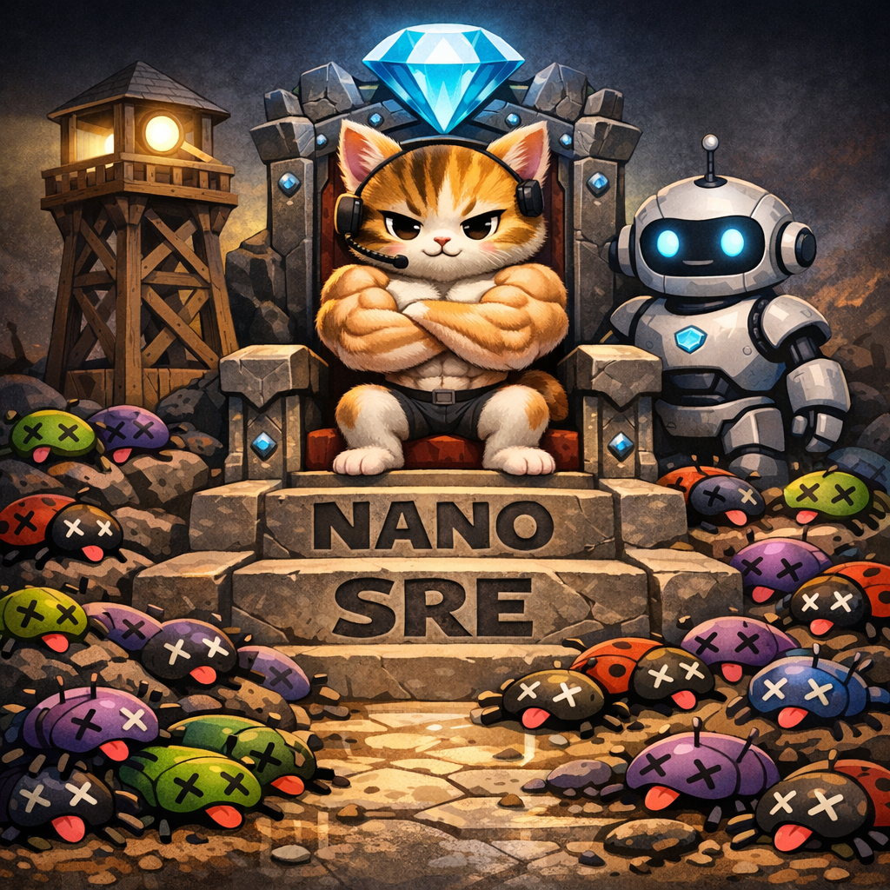

<div align="center">
  
  <h1>NANO-SRE</h1>
  <p><strong>Open-source incident triage stack for solo founders and small teams.</strong></p>
</div>

`NANO-SRE` combines:
- **Nanobot** as the conversational secretary (Telegram-first UX)
- **Keep** as the alert aggregation and persistence layer
- **nano-sre-harness** as the high-power triage engine (Pi Agent SDK + OpenRouter)

## Why This Architecture

1. **Nanobot stays lightweight**: great UX, channel routing, periodic summaries, operator-friendly communication.
2. **Harness does deep reasoning**: long triage sessions, correlation, structured verdicts, HTML artifacts.
3. **Keep is the source of truth**: alert history, enrichment, provider integrations (Sentry/Grafana/Loki/etc).
4. **Gemini path for multimodal triage**: image-first debugging and rapid synthesis with low latency and low cost.

This separation keeps the chat interface stable while swapping models/harness behavior over time.

## Core Outcomes

- Incremental triage updates in chat
- Correlation IDs across services
- Structured verdicts (`severity`, `category`, `confidence`, actions)
- Portable HTML incident reports
- Local-first dev flow with VPS-ready deployment parity

## Open Source And Free-Model Friendly

Everything in this project is open source.

You can run the stack with low cost or near-zero model cost by allowing OpenRouter to route to free models (when available). For production workloads, pin to a reliable paid model.

## Repository Layout

- `docker-compose.yml`: local stack orchestration
- `services/nano-sre-harness/`: custom triage harness (Pi Agent SDK)
- `nanobot/config.example.json`: baseline Nanobot config
- `nanobot/workspace/`: starter identity/persona docs (PII-free)
- `docs/ARCHITECTURE.md`: service map + sequence diagrams
- `docs/DESIGN_PROCESS.md`: design journey, tradeoffs, and validation history
- `docs/INITIAL_VALIDATION.md`: initial verification checklist and outcomes
- `scripts/`: bootstrap/up/down helpers

## Quick Start (Local)

1. Prepare deps and config:

```bash
cd ~/dev/nano-sre
./scripts/bootstrap.sh
cp .env.example .env
cp nanobot/config.example.json nanobot/config.json
```

2. Fill secrets in `.env`:
- `OPENROUTER_API_KEY`
- `KEEP_LOKI_PROVIDER_ID` (after installing Loki provider in Keep)
- `NANO_SRE_SERVICE_TOKEN` (recommended)

3. Start services:

```bash
./scripts/up.sh
```

4. Start Nanobot service (optional profile):

```bash
docker compose --profile nanobot up -d nanobot
```

5. Access endpoints:
- Keep UI: `http://localhost:38000`
- Keep API: `http://localhost:38080`
- nano-sre-harness: `http://localhost:38790/healthz`
- Nanobot gateway: `http://localhost:18790`

## VPS Migration

Use the same compose/env layout on VPS to minimize reconfiguration.

- Keep `.env` contract identical
- Reuse `nanobot/config.json` with production-safe allowlists
- Point Telegram and provider credentials to server-managed secrets
- Set `NANOBOT_ENV=production`

See `docs/ARCHITECTURE.md` and `docs/DESIGN_PROCESS.md` for full flow.
