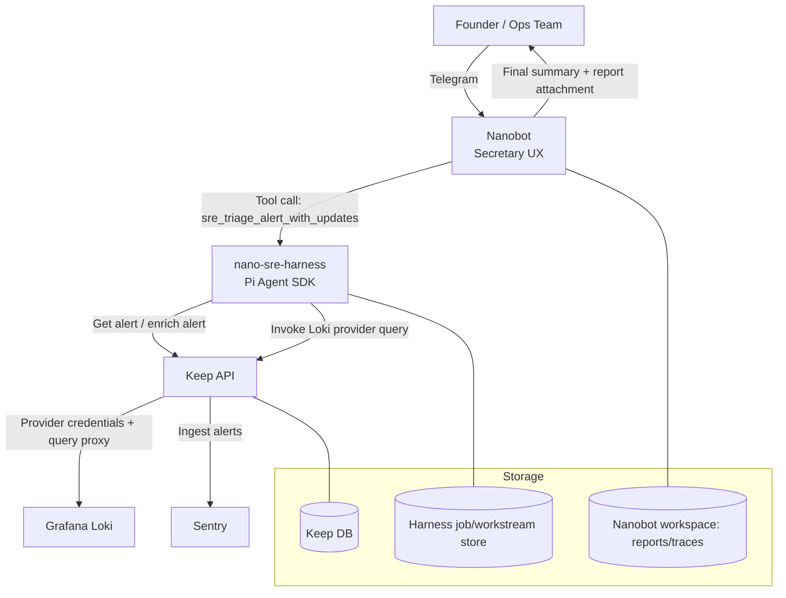
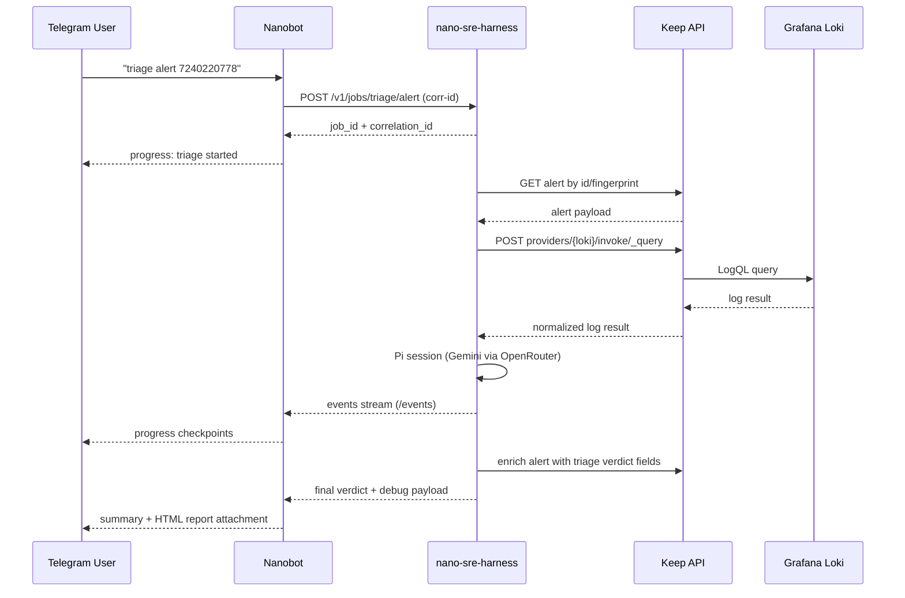
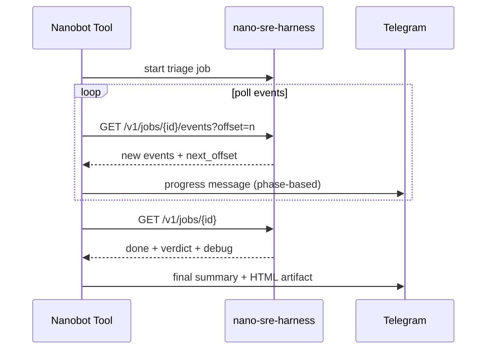

# nano-sre Architecture

## Service roles

- **Nanobot**
  - Role: secretary/orchestrator
  - Responsibilities: channel IO (Telegram), progress messaging, user profile adaptation, invoking harness tools
  - Why it matters: keeps operator communication tight and continuous while long triage runs in background

- **nano-sre-harness (Pi Agent SDK)**
  - Role: high-power triage engine
  - Responsibilities: fetch Keep alert, query Loki via Keep provider, run LLM synthesis, emit structured verdict, stream events
  - Why it matters: isolates complex reasoning and model evolution from chat UX

- **Keep**
  - Role: persistence + aggregation platform
  - Responsibilities: ingest provider alerts, expose alert/query APIs, enrich alerts with verdict fields
  - Why it matters: unified incident history and provider abstraction

- **External providers (read-only)**
  - Examples: Sentry, Grafana/Loki, email/webhooks, cloud telemetry
  - Why it matters: source signal for triage

## Service map

## End-to-end triage sequence

## Incremental updates flow

## Data contracts

- **Correlation ID**
  - Propagated via `x-correlation-id`
  - Returned by harness APIs
  - Included in final user-visible output

- **Verdict schema**
  - `severity`, `category`, `root_cause_hypothesis`, `affected_services`, `recommended_actions`, `confidence`, `evidence_summary`, `suggested_runbook`

- **Artifacts**
  - `summary_text`: concise operator message
  - `report_path`: HTML report for async review/handoff
  - `debug`: model/prompt/event metadata (optional)

## Why this works for solo founders and small teams

- Cuts context switching by centralizing incidents in one chat workflow
- Reduces panic during incidents via progressive transparency
- Produces durable artifacts for async collaboration
- Scales from one person to a small team without new platform complexity
